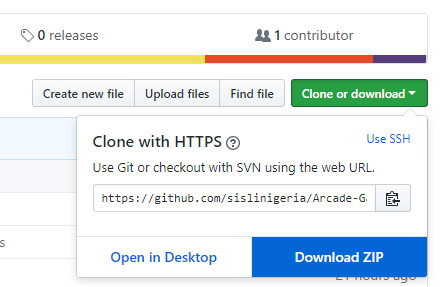

frontend-nanodegree-arcade-game
===============================

## Table of Contents

* [Requirements](#requirements)
* [Installation](#installation)
* [How to Play](#How-to-play)
* [Contributing](#contributing)
* [Status](#status)
* [License](#license)
* [Credit](#credit)

## Requirements

To achieve this game, I had to breakdown the steps of the things I needed to do. Which includes the following;
* I already have the HTML structure, the game engine, resources and images. All this was provided by Udacity.
* Game should have the ability to render the tiles, enemies and the player inside the canvas.
* Game should be able to restrict the movement of the player only within the canvas and the enemies to move out and back into the canvas (Screen) randomizing it's speed rate.
* Use an `if` to return the player to the starting position any time it collide with an enemy.
* Implement the arrow keys to work and also set the length of each tile for the player character to move.
* In summary I tried to maintain the specifications stated on the project rubrics
    * Player can not move off screen
    * Vehicles cross the screen
    * Vehicle-player collisions happen logically (not too early or too late)
    * Vehicle-player collision resets the game
    * Something happens when player wins - game restart/player returns to the start position.

## Installation

This is a Browser based game and need no installation. 
To Play, **click [HERE](https://sislinigeria.github.io/Arcade-Game-Clone/).**   
To Play the game locally, take the following steps;
* Go to the game git repo https://github.com/sislinigeria/Arcade-Game-Clone
* Download the zip file to your PC by clicking on **clone or download**, then **Download ZIP**
   
* Unzip the downloaded folder to your local disk
* Inside the Game Folder, Double click on *index.html*
* Then start playing.

## How to play
The objective of the game is to move the queen to the water without colliding with the enemies.
* Use the **Up Arrow** key to move the queen (Player) up one tile at a time.
* Use the **Down Arrow** key to move the queen (Player) down one tile at a time
* Use the **Left Arrow** key to move to the left side of the screen one tile at a time
* Use the **Right Arrow** key to move to the right side of the screen one tile at a time.

Move the queen to the water, avoid colliding with the enemies.

## Contributing

This repository is a copy of the master commit in Udacity repository as part of the project of FRONT END WEB NANODEGREE Program. It is a work of a beginner programmer and reviews are welcomed and should be directed [Here](mailto:sixtus.nnamdi@gmail.com). 
If you wish to contribute to this project, kindly fork it, and push to a new branch of the master repo https://github.com/sislinigeria/Arcade-Game-Clone.git

## Status

This project is still being iterated from time to time. As I progress in my Nanodegree program, I will be implementing new features like;
* Adding Collectable items on Screen
* Multiple Vehicle types
* Timing the game
* Different Difficult levels
* Winner Congratulation Pop-up (Model)
* Adding Score Board

## License

This project was submitted by [Sixtus Nnamdi](www.linkedin.com/in/sixtus-nnamdi) as part of the Front End Web Nanodegree program at Udacity.

As part of Udacity Honor code, your submissions must be your own work, hence submitting this project as yours will cause you to break the Udacity Honor Code and the suspension of your account.

Me, the author of the project (*basically, the HTML structure was provided, I only modified the HTML, Style the CSS and Code the JavaScript - app.js file*), allow you to check the code as a reference, but if you submit it, it's your own responsibility if you get expelled.

Besides the above notice, the following license applies and this license notice must be included in all works derived from this project. - 

##  Credit

Credit to this work goes to
* Udacity
* Google
* Youtube Video by Philip Mouris [Classic arcade game clone ](https://youtu.be/1YHkmEBznac)
* Youtube Hang-out Video Presented by Ryan Boris [Udacity FEND Webinar - Project #3 Walkthrough](https://youtu.be/JcQYGbg0IkQ)
* Youtube Video by Edoh Kodjo [fend-arcade-game](https://youtu.be/mgFWZGpj3IE)
* [Introduction to HTML5 Canvas](https://medium.com/@AmyScript/introduction-to-html5-canvas-8c1bad20e855)
* [HTML5 Canvas Tutorial](https://www.sitepoint.com/html5-canvas-tutorial-introduction/)
* [How To Write A Great README](https://robots.thoughtbot.com/how-to-write-a-great-readme)